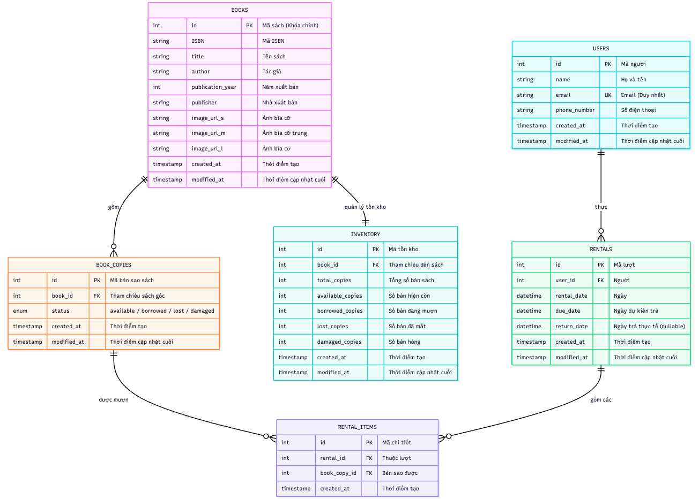

# FastAPI Library Management System

A comprehensive library management system built with FastAPI, PostgreSQL, and Docker. This system enables librarians to manage books, users, rentals, and inventory with a modern REST API and clean architecture.

## 📊 Data Model & Architecture

### Database Schema Overview



The system follows a normalized database design with six main entities that handle all aspects of library operations:

### 🏗️ Entity Relationship Details

#### 📚 **BOOKS Table**
**Purpose**: Master catalog of all book titles in the library

| Field | Type | Description |
|-------|------|-------------|
| `id` | int (PK) | Unique book identifier |
| `ISBN` | string (UK) | International Standard Book Number |
| `title` | string | Book title |
| `author` | string | Author name |
| `publication_year` | int | Year of publication |
| `publisher` | string | Publishing house |
| `image_url_s` | string | Small cover image URL |
| `image_url_m` | string | Medium cover image URL |
| `image_url_l` | string | Large cover image URL |
| `created_at` | timestamp | Record creation time |
| `modified_at` | timestamp | Last update time |

#### 👥 **USERS Table**
**Purpose**: Library patrons who can borrow books

| Field | Type | Description |
|-------|------|-------------|
| `id` | int (PK) | Unique user identifier |
| `name` | string | User's full name |
| `email` | string (UK) | Email address |
| `phone_number` | string | Contact number |
| `created_at` | timestamp | Registration time |
| `modified_at` | timestamp | Last profile update |

#### 📋 **INVENTORY Table**
**Purpose**: Track aggregate copy counts per book

| Field | Type | Description |
|-------|------|-------------|
| `id` | int (PK) | Unique inventory record |
| `book_id` | int (FK) | Reference to BOOKS table |
| `total_copies` | int | Total physical copies owned |
| `available_copies` | int | Currently available for borrowing |
| `borrowed_copies` | int | Currently checked out |
| `lost_copies` | int | Missing/lost copies |
| `damaged_copies` | int | Damaged copies needing repair |
| `created_at` | timestamp | Record creation time |
| `modified_at` | timestamp | Last inventory update |

#### 📖 **BOOK_COPIES Table**
**Purpose**: Individual physical copies with status tracking

| Field | Type | Description |
|-------|------|-------------|
| `id` | int (PK) | Unique copy identifier |
| `book_id` | int (FK) | Reference to BOOKS table |
| `status` | enum | Current status (available/borrowed/lost/damaged) |
| `created_at` | timestamp | Copy creation time |
| `modified_at` | timestamp | Last status update |

#### 🔄 **RENTALS Table**
**Purpose**: Borrowing transactions

| Field | Type | Description |
|-------|------|-------------|
| `id` | int (PK) | Unique rental identifier |
| `user_id` | int (FK) | Reference to USERS table |
| `rental_date` | datetime | When books were borrowed |
| `due_date` | datetime | When books should be returned |
| `return_date` | datetime | When books were actually returned (nullable) |
| `created_at` | timestamp | Transaction creation time |
| `modified_at` | timestamp | Last transaction update |

#### 📝 **RENTAL_ITEMS Table**
**Purpose**: Individual books within a rental transaction

| Field | Type | Description |
|-------|------|-------------|
| `id` | int (PK) | Unique rental item identifier |
| `rental_id` | int (FK) | Reference to RENTALS table |
| `book_copy_id` | int (FK) | Reference to BOOK_COPIES table |
| `created_at` | timestamp | Item addition time |

### 🔗 Relationship Analysis

1. **BOOKS ↔ INVENTORY** (1:1)
   - Each book has exactly one inventory record
   - Tracks aggregate statistics for all copies of that book

2. **BOOKS ↔ BOOK_COPIES** (1:N)
   - One book can have multiple physical copies
   - Each copy has individual status tracking

3. **USERS ↔ RENTALS** (1:N)
   - One user can have multiple rental transactions
   - Complete borrowing history is maintained

4. **RENTALS ↔ RENTAL_ITEMS** (1:N)
   - One rental can include multiple books
   - Enables borrowing multiple books in one transaction

5. **BOOK_COPIES ↔ RENTAL_ITEMS** (1:N)
   - One copy can be borrowed multiple times (over time)
   - Tracks which specific copy was borrowed

## 🏛️ System Architecture

```
┌─────────────────┐    ┌─────────────────┐    ┌─────────────────┐
│   API Layer     │    │  Business Layer │    │   Data Layer    │
│                 │    │                 │    │                 │
│ • FastAPI       │    │ • Repositories  │    │ • SQLAlchemy    │
│ • Pydantic      │◄──►│ • Business      │◄──►│ • PostgreSQL    │
│ • Validation    │    │   Logic         │    │ • Models        │
│ • Serialization │    │ • Domain Rules  │    │ • Relationships │
└─────────────────┘    └─────────────────┘    └─────────────────┘
```

### Architecture Layers:

- **API Layer** (`src/api/`): FastAPI routers, request/response handling
- **Schema Layer** (`src/schemas/`): Pydantic models for validation
- **Business Layer** (`src/repositories/`): Business logic and data operations
- **Model Layer** (`src/models/`): SQLAlchemy ORM models
- **Infrastructure** (`src/utils/`): Database connections, utilities

## 🚀 Getting Started

### Prerequisites

- Docker & Docker Compose
- Git

### 📋 Quick Setup

1. **Clone the repository**
   ```bash
   git clone <repository-url>
   cd practice-fastapi
   ```

2. **Set up environment variables**
   ```bash
   cp .env.sample .env
   # Edit .env if needed - default values work for development
   ```

3. **Start the application**
   ```bash
   # Option 1: Using Makefile (recommended)
   make dev

   # Option 2: Using docker-compose directly
   docker-compose -f docker-compose.yaml -f docker-compose.dev.yaml up -d
   ```

4. **Access the application**
   - **API Documentation**: http://localhost:8000/docs
   - **Alternative Docs**: http://localhost:8000/redoc
   - **pgAdmin**: http://localhost:5050 (admin@library.com / admin123)

### 📚 Import Sample Data

```bash
# Import books with random copies and statuses
make import-books

# Or manually:
docker-compose exec web python import_books.py --clear
```

## 🔧 Available Commands

### Using Makefile (Recommended)

```bash
# View all available commands
make help

# Development
make dev          # Start with pgAdmin and debug logging
make up           # Start all services
make down         # Stop all services
make restart      # Restart all services
make logs         # View logs

# Database operations
make import-books # Import sample book data
make db-shell     # Connect to PostgreSQL shell
make app-shell    # Connect to FastAPI container shell

# Maintenance
make build        # Rebuild Docker images
make clean        # Remove all containers and volumes
make check        # Check service health
```

### Manual Docker Commands

```bash
# Start all services
docker-compose up -d

# Start with development tools
docker-compose -f docker-compose.yaml -f docker-compose.dev.yaml up -d

# View logs
docker-compose logs -f

# Stop services
docker-compose down

# Complete cleanup
docker-compose down -v --rmi all
```

## 📖 API Documentation

### 🔍 Main Endpoints

#### Books Management
```http
GET    /api/books/              # List all books
GET    /api/books/available     # Books with available copies
GET    /api/books/search        # Search by title/author/ISBN
GET    /api/books/{id}          # Get specific book
POST   /api/books/              # Add new book
PUT    /api/books/{id}          # Update book
DELETE /api/books/{id}          # Remove book
```

#### User Management
```http
GET    /api/users/              # List all users
GET    /api/users/search        # Search users
GET    /api/users/{id}          # Get user details
POST   /api/users/              # Register new user
PUT    /api/users/{id}          # Update user
DELETE /api/users/{id}          # Remove user
```

#### Rental Operations
```http
POST   /api/rentals/rent        # Borrow books
POST   /api/rentals/return      # Return books
GET    /api/rentals/            # List all rentals
GET    /api/rentals/overdue     # Get overdue rentals
GET    /api/rentals/user/{id}   # Get user's rentals
GET    /api/rentals/{id}        # Get rental details
```

### 📝 Example API Calls

#### Borrow Books
```bash
curl -X POST "http://localhost:8000/api/rentals/rent" \
  -H "Content-Type: application/json" \
  -d '{
    "user_id": 1,
    "book_ids": [1, 2, 3],
    "due_date": "2025-08-15T10:00:00"
  }'
```

#### Return Books
```bash
# Return entire rental
curl -X POST "http://localhost:8000/api/rentals/return" \
  -H "Content-Type: application/json" \
  -d '{"rental_id": 1}'

# Return specific copies
curl -X POST "http://localhost:8000/api/rentals/return" \
  -H "Content-Type: application/json" \
  -d '{"book_copy_ids": [1, 2]}'
```

#### Search Books
```bash
curl "http://localhost:8000/api/books/search?title=python&author=smith"
```

## 🗄️ Database Management

### Direct Database Access

```bash
# Connect to PostgreSQL shell
make db-shell

# Or manually:
docker-compose exec db psql -U admin -d practice_fastapi
```

### pgAdmin Web Interface

1. Access pgAdmin at http://localhost:5050
2. Login with `admin@library.com` / `admin123`
3. Add server connection:
   - Host: `db`
   - Port: `5432`
   - Database: `practice_fastapi`
   - Username: `admin`
   - Password: `Admin123`

### Backup and Restore

```bash
# Backup database
docker-compose exec db pg_dump -U admin practice_fastapi > backup.sql

# Restore database
docker-compose exec -T db psql -U admin practice_fastapi < backup.sql
```

## 🔧 Configuration

### Environment Variables

| Variable | Default | Description |
|----------|---------|-------------|
| `POSTGRES_USER` | `admin` | Database username |
| `POSTGRES_PASSWORD` | `Admin123` | Database password |
| `POSTGRES_DB` | `practice_fastapi` | Database name |
| `PGADMIN_EMAIL` | `admin@library.com` | pgAdmin login email |
| `PGADMIN_PASSWORD` | `admin123` | pgAdmin password |
| `DOCKER_ENV` | `true` | Docker environment detection |

### Application Settings

Edit `.env` file to customize:
- Database credentials
- Admin interface access
- Debug settings
- Log levels

## 🧪 Testing

### Manual Testing
- Use interactive API docs at http://localhost:8000/docs
- Import sample data for realistic testing scenarios
- Test with curl commands or Postman

### Health Checks
```bash
# Check all services
make check

# Individual health endpoints
curl http://localhost:8000/health
```

## 📁 Project Structure

```
practice-fastapi/
├── 📁 src/                    # Source code
│   ├── 📁 api/               # FastAPI routers
│   │   ├── books.py          # Book endpoints
│   │   ├── users.py          # User endpoints
│   │   ├── rentals.py        # Rental endpoints
│   │   └── main_router.py    # Main API router
│   ├── 📁 models/            # SQLAlchemy models
│   │   ├── book.py           # Book & related models
│   │   ├── user.py           # User model
│   │   ├── rental.py         # Rental models
│   │   ├── book_copy.py      # Book copy model
│   │   └── inventory.py      # Inventory model
│   ├── 📁 schemas/           # Pydantic schemas
│   │   ├── book.py           # Book validation
│   │   ├── user.py           # User validation
│   │   └── rental.py         # Rental validation
│   ├── 📁 repositories/      # Data access layer
│   │   ├── base.py           # Base repository
│   │   ├── book_repository.py
│   │   ├── user_repository.py
│   │   └── rental_repository.py
│   ├── 📁 utils/             # Utilities
│   │   └── db_utils.py       # Database connections
│   └── dependencies.py       # Dependency injection
├── 📁 init-scripts/          # Database initialization
├── 📄 main.py                # FastAPI application
├── 📄 import_books.py        # Data import script
├── 📄 docker-compose.yaml    # Docker services
├── 📄 docker-compose.dev.yaml # Development overrides
├── 📄 Dockerfile             # Application container
├── 📄 Makefile               # Convenience commands
├── 📄 requirements.in        # Python dependencies
└── 📄 .env                   # Environment variables
```

## 🔄 Business Logic Features

### Smart Rental System
- **Auto-Assignment**: Automatically finds available copies for borrowing
- **Multi-Book Rentals**: Borrow multiple books in one transaction
- **Flexible Returns**: Return entire rental or individual books
- **Due Date Management**: Automatic 14-day default, custom dates supported

### Inventory Management
- **Real-time Updates**: Inventory counts update with each transaction
- **Status Tracking**: Available, borrowed, lost, damaged status per copy
- **Availability Checks**: Prevents borrowing unavailable books

### Search & Discovery
- **Flexible Search**: Search by title, author, or ISBN
- **Availability Filter**: Find only books with available copies
- **Pagination**: Efficient handling of large datasets

